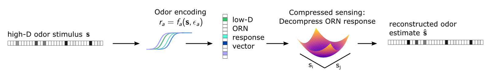
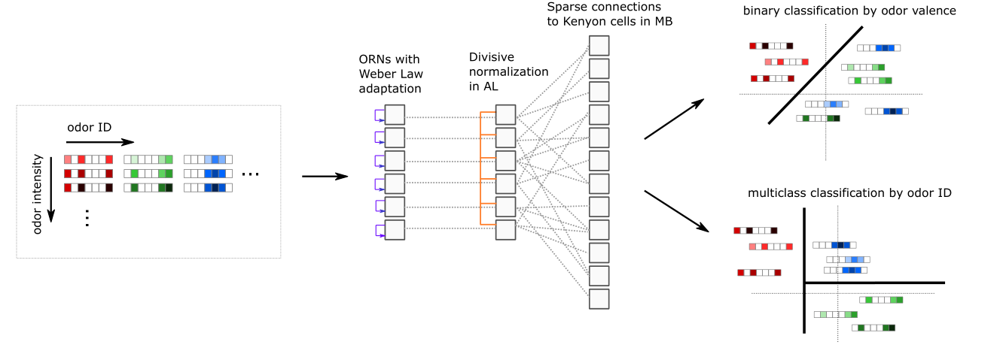

# adaptive-olfactory-neuron-coding

This code allows the exploration of how well odor signals are coded by by *Drosophila* olfactory olfactory receptor neurons (ORNs). The model uses a stochastic biophysical model of ORN response to model how odor signals are encoded in the repertoire of ORNs, and compressed sensing and neural network models to decode these signals from either the responses of ORNs, or from mushroom body neurons further downstream in the olfactory circuit.

## Publication

This work was published in *eLife* in July 2019. The article can be viewed open-access here:

https://elifesciences.org/articles/45293






## Getting Started

### Installation

The code runs in Python 3 with just a few scientific and plotting packages. Neural network classification tasks require [TensorFlow](https://www.tensorflow.org/). The code has been run on and tested with Anaconda, and it is recommended to create an environment, using the package list via the adaptive-olfactory-neuron-coding.yml:	

```
$ conda env create -f adaptive-olfactory-neuron-coding.yml
```

Tensorflow installed with the yml file may not be optimized for your machine specifications, so for better performance (say, GPU capability), you may re-install it separately following their documentation.

## Usage

The biological system consists of many nonlinear sensors (the ORNs), responding to an odor stimulus which consists of several odor components. This is the coding task. Decoding takes the repertoire of ORN responses and either reconstructs or clusters the generating signal from these responses. 

There are several user-defined specifications for each such task, consisting of choice of stimulus, sensor statistics, the nature of the adaptive feedback, etc. To allow the user versatility in testing, all of these parameters are specified in a so-called "specs file", which contains all coding and decoding specifications. Every simulation or estimation requires a specs file. Writing them is straightforward, and they are allow for a good deal of versatility.

### Define the local directories

First, we must define the local directories where files will be saved. Copy **src/local_methods_sample.py**  to an (untracked) file **src/local_methods.py**. In this file, redefine the function `def_data_dir()` to return the string of the directory where you want data to be stored. Do the same for `def_analysis_dir()`, where the analysis files will be stored.

### Define a set of ORN compressed sensing decoding tasks in a *specifications* file 

Each compressed sensing decoding task uses parameters defined in a *specifications* text file. This file is placed in a **specs/** subfolder of the data directory defined by `def_data_dir() `(see above). The file is tab-delimited, an example is placed in the main directory of the source, and is shown here:

| iter_var  | mu_Ss0          | exp              | -2   | 4    | 40   | 10   |
| --------- | --------------- | ---------------- | ---- | ---- | ---- | ---- |
| iter_var  | seed_dSs_2      | lin              | 1    | 25   | 25   |      |
|           |                 |                  |      |      |      |      |
| fixed_var | mu_min_eps      | 10               |      |      |      |      |
| fixed_var | hi_Kk2_hyper_hi | 1e0              |      |      |      |      |
|           |                 |                  |      |      |      |      |
| param     | Nn              | 150              |      |      |      |      |
|           |                 |                  |      |      |      |      |
| rel_var   | mu_dSs          | mu_Ss0/3.0       |      |      |      |      |
|           |                 |                  |      |      |      |      |
| run_spec  | run_type        | power_Kk_adapted |      |      |      |      |

The first column is the type of parameter being set. The second column is the name of the parameter. 

Possible parameters are listed in the initialization `four_state_receptor` class of **four_state_receptor.py**. 

*iter_var* is used for variables to be swept over many values, either linearly or logarithmically (*lin* or *exp* in 3rd column). For logarithmic sweeping, the subsequent columns indicate the min, max, number of steps (min and max inclusive), and base; for linear the next columns indicate min, max, and number of steps. So here, **seed_dSs_2** will be run for 1, 2, 3, ..., 25. 

*fixed_var* are held fixed at the float values indicated in the 3rd column. *param* are like these, but are integer-valued.

*rel_var* are values that depend on one of the *iter_var*. The 3rd column describes this dependency. 

*run_spec* is which type of decoding task; at this point, 2nd column is always *run_type*. Possible run types are methods of `four_state_receptor` that are preceded by `encode`, such as `encode_uniform_activity`. The 3rd column is the name of the method, less the word "encode". 

All data will be saved in the data directory, under the subfolder with the same name as the specifications file. 

### Run a single decoding task

To run the decoding task, in the **scripts/** folder run:

````
$ cd scripts
$ python CS_run.py specs_file num1 num2 ...
````

where *specs_file* is the name of the specifications files (minus the extension), and num1,... are the indices of the iterated variables. In our example, there are two iterated variables, up to 40 and 25 values respectively. So num1 can range from 0 to 39 and num2 from 0 to 24. In this sense, the 40x25 runs can be run in parallel on a cluster with an appropriate batch script.

### Aggregate all decoding tasks from single specifications file

After running all the different combinations in iter_vars (e.g. in parallel; in our example this is 40x25 runs), the individual output pickle files can be aggregated into a single one:

````console
$ cd scripts
$ python aggregate_objects.py specs_file
````

This saves  **aggregated_objects.pklz**, an array of individual object instances of `four_state_receptor`, one for each combination of the *iter_vars*. Use the function `load_aggregated_object_list` from **src/load_data.py** to load the list. It has the same shape as the *iter_vars* dimensions, in this case 40x25. 

### Analysis

Functions to analyze the data, such as calculate decoding errors, are in **src/analysis.py**. Most of these scripts will be passed as the first argument a single `four_state_receptor` object instance -- i.e., one of the array elements of the loaded aggregated object. 